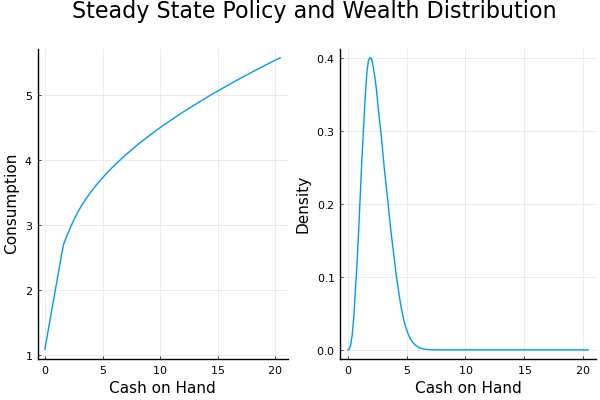
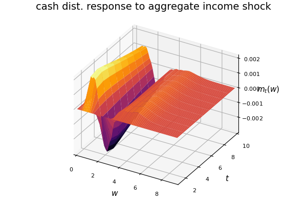
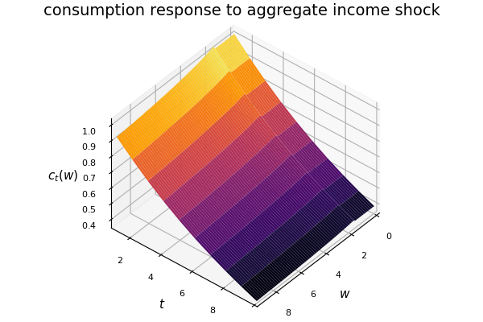
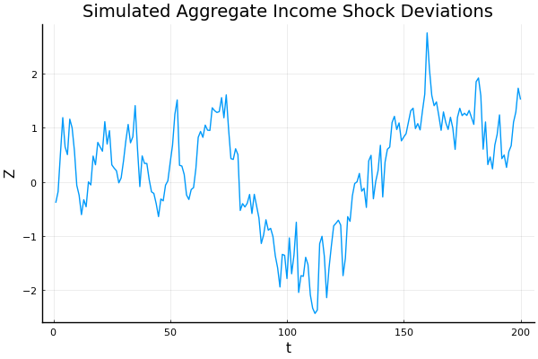
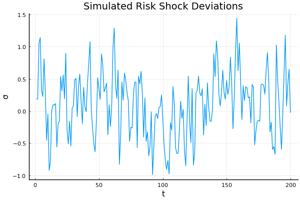
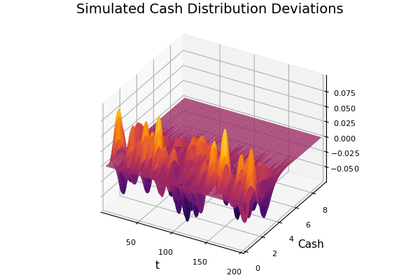
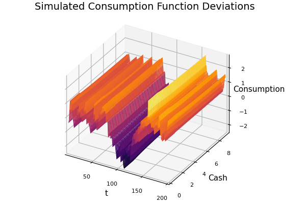
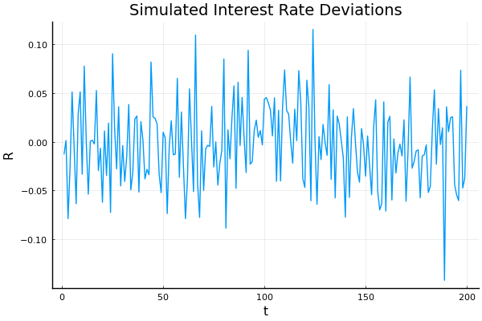

## Heterogeneous Agent Models

- Motivation
- Cross-sectional Distributions
    - Kolmogorov Forward/Fokker-Planck Equations
- Parameter Estimation
- Steady State: Huggett procedure
- Nonstochastic Dynamics
- Stochastic Dynamics 
    - Krusell-Smith Method
    - Perturbation Method

## Motivation

- Dynamic optimization describes behavior of single agent
    - Consumer, Firm, Household, Government
- How to describe population of these agents?
    - Derive cross-sectional distribution implied by behavior
    - Consider feedback from distribution to behavior
    - Solve for fixed point: equilibrium
- Applications
    - Distribution allows estimating model parameters
    - May care about feedback
        - Role of heterogeneity in economic environment
    - May care about distributions directly
        - Find how it evolves or changes
    

## Example Model: (Approximately) Huggett (1993)

- Standard consumption savings problem we have seen all class
- Assume 1 bond with return $R$, lower limit $\underline{a}$ on borrowing
- Typical agent $i$ chooses $c_t^{i}$ to solve
\begin{multline*}
\max\mathbb{E}_{0}\sum_{t=0}^{\infty}\beta^{t}\dfrac{(c_{t}^{i})^{1-\gamma}}{1-\gamma}\\
\text{s.t. }w_{t+1}^{i}=R_{t}(w_{t}^{i}-c_{t}^{i})+s_{t}^{i}\\
R_{t}(w_{t}^{i}-c_{t}^{i})\geq\underline{a},\ \underline{a}<0
\end{multline*}
- Income $s_{t}^{i}\sim g(.)$ drawn iid over time **and** across individuals
- Everyone solves same problem, *but* 
    - Receives different draw of income $s$
    - So chooses different consumption $c$ 
    - Ends up with different wealth $w$
- Heterogeneity encoded in random variables
    - Model provides complete statistical description of data    

## Huggett Model: Goals

- Tasks    
    1. Derive joint distribution of consumption, income, wealth $(c_t^i,s_t^i,w_t^i)$
    2. Allow feedback: let interest rate $R$ be endogenous
    3. Add "aggregate" variability, so distribution also random
- Distribution of $s^{i}$ is given $g(s)$ 
- Policy function $c(w)$, law of motion for $w$ solved for by standard (dynamic programming) methods
- Use above objects to find *distribution* $m_t(w)$ of $w_t^i$ 
    - This is Kolmogorov Forward/Fokker Planck equation
- Feedback is feature added to model: use general equilibrium
    - Simplest: Market for bonds clears with 0 net supply
$$\int(w_{t}^{i}-c_{t}^{i})\text{d}i=0$$    
- For now, assume steady state: 
    - Individual income and choices dynamic, stochastic
    - Cross-section distribution (and so $R_t$) fixed
    
## Kolmogorov Forward Equation

- Turns policy rule into density rule
- Intuition simpler in finite state case
    - Let $\left[H\right]_{ij}=Pr(x^\prime=j|x=i)$
- Then, given population with $Pr(x=i)=[m]_i$, next period distribution is 
$$m^{\prime}=H^{T}m$$
- Rule is transpose ("adjoint") of Markov transition matrix
    - Hence called "adjoint Markov operator"
- Continuous state case same: switch integrand in conditional expectation 
    - $H[\phi]:=E[\phi(x^\prime)|x]=\int\phi(x^\prime)f(x^\prime|x)dx^\prime$
    - $H^{*}[m]=\int m(x) f(x^\prime|x)dx$
- Obtain next density from conditional density, current density
- Use initial (or terminal) conditions or steady state requirement $m=m^\prime$ to find implied path
- Model doesn't directly give conditional density, but can derive it    

## Deriving KFE From Policy Rule 

- Assume rule $x^{\prime}=h(x,\epsilon)$, where $\epsilon\sim G(\epsilon)$
- Population follows above rule, with independent draws of $\epsilon$
- Assume current distribution of $x$ in this population is $\mu(x)$
- "Adding up" rule: expectation of any function of $x^\prime$ tomorrow is expectation of that function over distribution of $x,\epsilon$
- For all $\phi(.)$, distribution $\mu^{\prime}$ satisfies
$$\int \phi(x^{\prime}) d\mu^{\prime}(x^{\prime})=\int \int \phi(h(x,\epsilon))d\mu(x)dG(\epsilon) $$
- Simplifies considerably if $h(x,\epsilon)$ has inverse $h^{-1}_x(x^\prime)$ in $\epsilon$ for every $x$, and $\mu,G$ have densities $m,g$
- (Apply above to $1\{x^\prime\leq z\}$ to get law for CDF, differentiate to get PDFs, and apply change of variables)
$$m(x^{\prime}) =\int g(h_x^{-1}(x^\prime))\left|\det\frac{dh_x^{-1}(x^{\prime})}{dx^{\prime}}\right|m(x)dx$$
- This expresses $m(x^\prime)=\int f(x^\prime|x)m(x)dx$ using conditional density implied by rule

## Continuous time case: Fokker-Planck Equation

- In continuous time case, $x$ follows diffusion equation
$$dx=\mu(x,t)dt+\sigma(x,t)dW$$
- Evolution of conditional expectation described by "infinitesimal generator" $A[\phi]=\frac{dE[\phi(x_{t+\Delta})|x_t]}{d\Delta}$
- Apply It$\bar{o}$'s lemma to obtain $A[\phi]=\phi^{\prime}(x)\mu(x)+\frac{\sigma(x)^2}{2}\phi^{\prime\prime}(x)$
- Evolution of distribution described by its ($L^2$) adjoint $A^{*}$
- Density $m(x,t)$, it evolves as $\frac{\partial}{\partial t}m(x,t)=$
$$A^{*}[m(x,t)]:=-\frac{\partial}{\partial x}(m(x,t)\mu(x,t))+\frac{\partial^2}{\partial x^2}(\frac{\sigma(x,t)^2}{2}m(x,t))$$
- Steady state: Assume $\mu,\sigma$ depend only on $x$, set LHS to 0
    - Second order PDE in $m$  
- Can extend to jump processes, multiple dimensions

## Solving Kolmogorov Forward Equation

- Solve for policy using standard dynamic programming method
- KFE is a functional equation
    - Represent density $m(x)$ by function representation
    - Linear in coefficients if $m(x)=\sum_{i=1}^{k}a_i\phi_i(x)$
- If discrete or discretized, KFE is a Markov matrix $H^*$
    - Transpose of discretized differential operator in HJB equation
- May need to impose that density nonnegative, sums to 1
    - Divide each column by sum of entries
    - Or add additional equation
- If solving for steady state, this is fixed point $m=H^*m$
    - Can use fixed point iteration
-  Linear fixed point is eigenproblem 
    - Use eigensolver to find eigenvector with eigenvalue closest to 1
        - 0 in continuous time
    - Guaranteed to exist if normalized (Frobenius-Perron thm)
    - May need to multiply by $-1$ to ensure sign correct
- Can "solve" by simulating many agents forward
    - Error bad, but no need to derive formula

## Application 1: Estimation

- Above results enough to perform estimation if all agents iid
- Given parameters $\theta$, solve optimization for law of motion
- Solve KFE for steady state density $\tilde{m}(x,\theta)$
- Given data $\{x_i\}_{i=1}^{n}$, find MLE or Bayes 
    - $\hat{\theta}_{MLE}=\underset{\theta}{\arg\max}\sum_{i=1}^{n}\log \tilde{m}(x_i,\theta)$
    - Given prior $\pi(\theta)$, run MCMC to sample from $\pi(\theta|X)\propto\tilde{m}(x_i,\theta)\pi(\theta)$
- Note: need numerical error in likelihood of $o(\frac{1}{\sqrt{n}})$ to be able to ignore approximation error in asymptotic results[^1]
- With panel data, can use conditional densities directly
    - Derive these from Fokker-Planck in continuous time
- When some individual variables unobserved, need to marginalize
    - Use filtering methods (Kalman if linear, Particle o/w)
    - or just simulate and match moments

[^1]: And other conditions: see Kristensen $\&$ Salanié (2017)

## Adding Feedback

- Optimization and KFE describe population behavior in given environment
- Close model by adding response of environment to behavior 
    - E.g. market clearing. Price matches supply and demand
    - Huggett Model: interest rate $R$ solves $\int(w-c(w,R))m(w)\text{d}w=0$
- More generally: parameter $P$ of decision problem depends on distribution through some "equilibrium condition"
- For some problems "$P$" is itself a function
    - Nash equilibrium: respond directly to others' behavior
    - Spatial/network models: response at every value of argument
- Steady state equilibrium is
    - Decision rule $h(.)$, distribution $\mu$, parameter $P$, st.
    1. Given $P$, $h(.)$ satisfies optimality condition
    2. $\mu$ satisfies steady state KFE derived from $h(.)$
    3. $P$ satisfies equilibrium condition given $h(.),\mu$
    
##  Solution Procedure: "Huggett Algorithm"   

- Write function $J(P)$ for equilibrium 
    1. Given $P$, solve optimization problem for policy rule $h(.)$
    2. Use $h(.)$ to solve KFE for steady state distribution $\mu$
    3. Output value of equilibrium condition equation given $h,\mu,P$
- Solve $J(P)=0$ by, e.g., bisection  

- Step 1 by Value/Policy iteration or projection for Euler equation
- Step 2 by fixed point iteration or eigensolver
- Step 3 usually involves numerical integration
- If $P$ a vector, use nonlinear solver
    - Keep tolerance large, since interior loops approximate
- If $P$ is function, use functional equation methods (projection, etc) to solve $J(P)=0$
- Nested structure convenient because interior problems often contraction *conditionally* on value of other arguments
- Could solve as 1 big system of equations if no nested structure

## Example: Huggett Model

- Reduce optimization problem to Bellman or Euler equation
    - Bellman easier, more robust, Euler gets rid of max
- Fix $R$, solve Euler for consumption rule 
$$\ell(w)  =  \mathbb{E}_{t}\beta R\int g(w'-R(w-c(w,\ell(w),R)))c(w',\ell(w'),R)^{-\gamma}\text{d}w^{\prime}$$ 
    - where $c(w,\ell,R)=\min\{\ell^{1/\gamma},w-\frac{\underbar{a}}{R}\}$
- "Parameterized Expectations" transform: $\ell(w)=$ $\beta\cdot$ expected m.u. of consumption (Christiano & Fisher 2000)
    - Turns Euler equation into fixed point problem 
    - Gets rid of Lagrange multipliers in equation
    - Represent $\ell(w)$ by basis functions, run fixed point iteration
- Solve KFE for $m(w)$
$$m(w')  = \int g(w'-R(w-c(w,\ell(w),R)))m(w)\text{d}w$$
  - Represent $m(w)$ by basis functions, solve by eigensolver
- Bisection in $R$ to solve $\int(w-c(w,\ell(w),R))m(w)\text{d}w=0$ 

## Results: Equilibrium Policy Function and State Distribution

## Extension: Nonstochastic dynamics

- Suppose initial condition $t=0$ not a steady state
- Nonstochastic dynamics can be solved by shooting method
    - Use Huggett algorithm to solve for steady state
    - Choose large $T$ for time economy returns to steady state
    - Conjecture **sequence** $\{P_t\}_{t=0}^{T}$, $P_t=P^{*}$ for $t>T$
    - Solve optimization problem given sequence (eg by iterating value functions backward)
    - Solve KFE forward from $\mu_0$ using sequence of policies
    - Check *sequence* of equilibrium conditions
    - Iterate over prices until equilibrium conditions satisfied
- Describes path response to unanticipated economic changes 
    - "MIT Shock": non-equilibrium parameter change 
        - Start at a steady state
        - Change a parameter of economic environment
        - Solve for path back to new steady state
    
## Stochastic Dynamics

- Consider adding random variables $Z_t$ that affect all agents
    - Business cycles: income distribution fluctuates
    - Aggregate policy (fiscal/monetary/regulatory)
- Creates major computational problem
    - Whole distribution shifts in response to shocks
    - Stochastic law of endogenous distribution enters decision problem
    - Value and policy functions take distribution as argument
- This is a functional equation "squared":
    - Functions to solve for are functions of functions: "Operators"
    - E.g. map from income distribution to spending
- Try to solve by functional equation approach
    - Projection
    - Perturbation
- How to represent infinite dimensional function?
    - Curse of dimensionality
    - Need approximation which reduces dimension
    
## Example: Huggett with aggregate shocks

- Take original Huggett model but
- instead of income $s^{i}_{t}\overset{iid}{\sim}g(.)$ face income $s^{i}_{t}+z_t$
    - $s_t^i\overset{iid}{\sim}g(.|\sigma_t)$, $\sigma_t, z_t$ shared for all agents
- $Z_t=(\sigma_t, z_t)$ are aggregate shocks to mean and variance of income risk
- Direct effect: 2 more variables in decision problem
- Indirect effects
    1. since shared, whole wealth distribution depends on them
    2. Interest rate now stochastic
    3. to keep track of interest rate, need to know state of shocks **and** distribution
- Decision rule $c(w,Z,m(.))$ takes additional arguments
    - One of which is a distribution
    
## Dimension reduction method 1: Krusell Smith method

- Projection represents decision/value function by basis functions over arguments
- Polynomials or discretization over $\infty$ arguments not representable
- So cut down $\#$ of arguments
- Maybe you don't really need full distribution $m(w)$
- Approximate by small number of summary statistics $\zeta$
    - Mean $\zeta_1=\int wm(w)dw$, Variance $\zeta_2=\int w^2 m(w)dw$, etc
    - Include enough info to describe components of state that matter for agents: eg, prices
    - $c(w,Z,\zeta)$ takes (small) finite number of arguments
- Idea: "approximate aggregation"
    - Only care about distribution as way to forecast $R$
    - Can get good forecast accuracy with just moments
    - Use this forecast in place of true law in decision rule
    - Solve for fixed point in which implied decision rule generates law consistent with forecast

## Krusell Smith Method: Steps

1. Conjecture a simple parameterized law of motion for $\zeta$
    - Typically linear conditional on shocks: e.g.
    $\zeta^\prime=\beta_0(Z)+\beta_1(Z)\zeta$
2. Solve optimization problem with conditional expectation over distribution given by above law
3. Simulate shocks $Z$, population of agents following policy, and prices each period
4. Re-estimate parameters $\beta$ for moments using simulated data
5. Repeat until coefs from simulated moments match conjectured coefficients

- Works well if you get good forecasts with just moments
    - Not a feature of all models: can fail, especially if many shocks
    - Interpret as behavioral: agents discard info to make forecast

## Perturbation Approach

- Linearization method from last class can be applied directly
    - Instead of scalar variables, allow **functions** to be variables
    - Instead of scalar derivatives, take **functional** derivatives
- Huggett model:
    - Variables are $\ell_t(.),m_t(.),\sigma_t,z_t,R_t$ 
    - Equations are Euler, KFE, market clearing, and law of shocks
- Functional derivative of a nonlinear operator $F(.)$ is a linear map between functions
    - $\int k(x,y)[.]dx$ is linear map taking $f(x)$ to $f(y)$
- Still $\infty$ dimensional but can approximate by Galerkin approach
    - Function valued variables replaced by vector of $k$ coefficients
    - Derivatives of equilibrium conditions just $k\times k$ matrices
- As $k\to\infty$, approximate derivatives converge
- Apply standard RE solver to derivative matrices
    - Approximates first order Taylor approx of policy operator
    
## Perturbation method: Details

- To use linearization, need nonstochastic steady state values
    - Only shut down *aggregate* shocks (e.g, $\sigma_t,z_t$, *not* $s^i_t$)
    - Exactly result of Huggett algorithm!
- Need system of equations differentiable w.r.t. functions
    - Usually means using FOC approach
- How to take functional derivatives?
    - Derive symbolically, then project to get coefs (Childers 2018)
- Alternate approach (Reiter (2009), Winberry (2018), Childers (2022))
    1. Represent functions by vector of coefficients or discretized values 
    2. Take scalar derivatives wrt points/coefs
- Discretization works, but inefficient for smooth functions
- Better method: take derivatives wrt points, get coefficients by interpolation

## Modified Perturbation: Steps

1. Represent Model as system of functional equations
\[
\mathbb{E}\mathcal{F}(x,y,x^{\prime},y^{\prime},\sigma)=0
\]
2. Solve for function values at nonstochastic steady state
\[
\mathcal{F}(x^{*},y^{*},x^{*},y^{*},0)=0
\]
3. Represent functions by their values at a set of grid points, and integral
equations by weighted sums
\[
\{\mathcal{\tilde{F}}(\{x(s_{j})\}_{j=1}^{n},\{y(s_{j})\}_{j=1}^{n},\{x^{\prime}(s_{j}^{\prime})\}_{j=1}^{n},\{y^{\prime}(s_{j}^{\prime})\}_{j=1}^{n},\sigma)(t_{i})\}_{i=1}^{n}=0
\]

4. Differentiate w.r.t. function values around steady state
\[
(\mathcal{\tilde{F}}_{x},\tilde{\mathcal{F}}_{y}),(\mathcal{\tilde{F}}_{x^{\prime}},\tilde{\mathcal{F}}_{y^{\prime}})
\]
5. Apply matrix transforms to get coefficient representation
\[
(\tilde{A},\tilde{B})=(M(\mathcal{\tilde{F}}_{x},\tilde{\mathcal{F}}_{y})M^{\intercal},M(\mathcal{\tilde{F}}_{x^{\prime}},\tilde{\mathcal{F}}_{y^{\prime}})M^{\intercal})
\]
6. Apply standard linear ratex solution code to matrices 
\[
\tilde{g}_{x},\tilde{h}_{x}\leftarrow\text{RE solver}(\tilde{A},\tilde{B})
\]

    
## Perturbation Application: Huggett with Aggregate Shocks

- Solve for steady state setting $z,\sigma$ shocks to 0
- Represent equilibrium conditions with functions $\ell(w),m(w)$ replaced by values at grid points
    - $\{m(w_{i})\}_{i=1}^{nw}$ $\{\ell(w_{i})\}_{i=1}^{nw}$
    - Integrals replaced by weighted w/ quadrature weights $\pi^{i}$
- E.g., Kolmogorov equation becomes $0=\mathcal{F}^{2}(.)(w_{j}^{\prime})=$
$$m_{t+1}(w_{j}')-\sum\pi^{i}g(w_{j}'-R_{t}(w_{i}+z_{t}-c(w_{i}+z_{t},\ell_{t}(w_{i}),R_{t}));\sigma_{t})m_{t}(w_{i})$$
- Euler, market clearing equations replaced similarly
- Apply automatic differentiation to get derivatives
- Map matrix on function values to matrix on coefficients
    - E.g., by Wavelet or just Histogram (piecewise constant) transform $M$
- Plug into RE algorithm to get policy functions 
    - $\tilde{h}_{x}$ maps $m(.),z,\sigma$ to $m^{\prime}(.),z^{\prime},\sigma^{\prime}$
    - $\tilde{g}_{x}$ maps $m(.),z,\sigma$ to $\ell(.),R$
    
## IRF: Response of wealth distribution to z

## IRF: Response of consumption function to z

## Simulation: Exogenous Shock Process $z_t$

## Simulation: Exogenous Shock Process $\sigma_t$

## Simulation: Endogenous Wealth Distribution

## Simulation: Endogenous Consumption Function

## Simulation: Endogenous Interest Rate

## Conclusions

- Dynamic models can incorporate heterogeneity and (mediated) interactions by deriving distribution
- Steady state needs 1 more functional equation (Kolmogorov) and a single loop
- Dynamics feasible by incorporating distribution as a state for projection/perturbation
- Krusell-Smith: Standard projection methods workable by massive dimensionality reduction
    - Preserves global, nonlinear effect of aggregates
    - No accuracy guarantees
- Perturbation: take functional derivatives, apply to projected distributions
    - Preserves nonlinearity in individual decisions, not in aggregates
    - Applicable even with many or infinite shocks
        - Whole function can be a stochastic process
    - Strong guarantees for first order

## References 1

- Childers, David. "Solution of Rational Expectations Models with Function Valued States" (2018)

    - "Automated Solution of Heterogeneous Agent Models" (2022)
    
- Christiano, Lawrence & Jonas Fisher. "Algorithms for Solving Dynamic Models with Occasionally Binding Constraints" (2000) *Journal of Economic Dynamics and Control* 24(8)

- Huggett, Mark. "The risk-free rate in heterogeneous-agent incomplete-insurance economies" (1993) *Journal of Economic Dynamics and Control* 17(5-6)

- Kristensen, Dennis & Bernard Salanié. "Higher Order Properties of Approximate Estimators" (2017) *Journal of Econometrics* 198(2)

## References 2

- Krusell, Per & Anthony A. Smith. "Income and Wealth Heterogeneity in the Macroeconomy" (1998) *Journal of Political Economy* 106(5)

- Reiter, Michael. "Solving Heterogeneous Agent Economies by Projection and Perturbation" (2009) *Journal of Economic Dynamics and Control* 33(3)

- Winberry, Thomas. "A Toolbox for Solving and Estimating Heterogeneous Agent Macro Models" (2018) *Quantitative Economics* 9(3)

