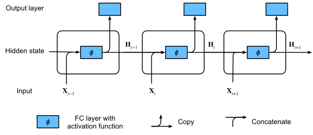
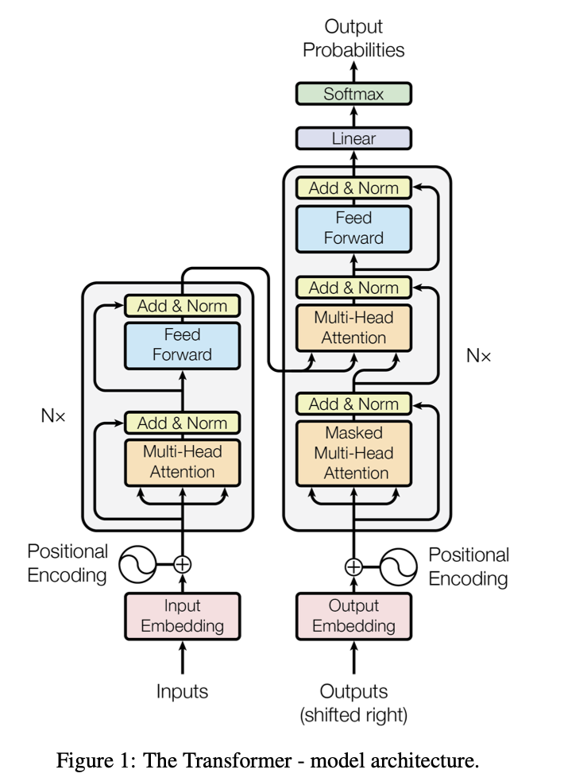

## Outline

- Neural network fundamentals
    - Models, training process, properties, architectures 
- Computation
    - Software, hardware, automatic differentiation  
- Economics use cases
    - Functional equations
    - Structural estimation
- Tutorial and demonstration
    - Arnav Sood: Tutorial and "Exploiting Symmetry in High Dimensional Dynamic Programming"
    - Kevin Mott: Application to OLG model: "Student Debt Forgiveness, Asset Prices, and Inequality" 
    
## Neural networks: what and why

- Deep neural networks are a class of nonlinear functions usable for high dimensional inputs
- Enable modeling at sizes not feasible with any other methods
    - HJB equations in 10,000 dimensions [(Beck et al 2021)](https://arxiv.org/abs/1907.03452)
    - Fully nonlinear heterogeneous agent models with aggregate shocks (Arnav and Kevin will cover today)
    - Dynamic programming in high dimensional environments like video games, robotics by "deep reinforcement learning"
    - Solution of multiplayer games like chess, go, poker 
- Enable modeling with object types not previously amenable to quantitative work
    - Text, images, audio/video
- Encourage you to think bigger about modeling and use of data
    - Can we do *structural* economic modeling endogenizing high dimensional objects like text or images?

## Neural Networks

- Given data $\mathcal{Z}_N=\{y_i,X_i\}_{i=1}^{N}$,  $X_i\in\mathbf{X}\subseteq\mathbb{R}^{K}$, $y_i\in\mathbf{Y}$ represent function $f:\ \mathbf{X}\to\mathbf{Y}$
- A neural network is element of a class $\mathcal{F}(\Theta)=\{f(,\theta):\ \mathbf{X}\to\mathbf{Y},\ \theta\in\Theta\}$ of nonlinear functions produced by **iterated composition** of many simple nonlinear functions called **neurons**
- Single "neuron": takes a $K\times 1$ vector $X$ to scalar
$$f_{j}(b_{0,j}+b_{1,j}x_1+b_{2,j}x_2+\ldots+b_{K,j}x_k)$$
    - Include a constant $b_{0,j}$ (the **bias**) along with $K$ coefficients on the inputs, called **weights**
- $f_j(u)$ is a fixed nonlinear function, e.g. $\max(u,0)$ ("**relu**") or $\tanh(u)$ or $\frac{\exp(u)}{1+\exp(u)}$ ("**sigmoid**"")
- Example: with sigmoid nonlinearity, a single neuron is exactly function fit by a logistic regression
- A **layer** is *vector* of $J$ neurons, with same inputs but different coefficients: $F^{(1)}(X)=\{f_j(X)\}_{j=1}^{J}$
    - Parameters of a layer are the $J\times K+1$ coefficients $b$ of the individual neurons
- Can take $J$ dimensional output of one layer as input vector to another layer, repeatedly
    - $Y=F^{(L)}(... F^{(2)}( F^{(1)}(X))))$
- Result is a **deep neural network**, and estimating its parameters is called **deep learning**

## Training: Stochastic Gradient Descent

- Want to approximately minimize $\widehat{R}(\theta)=\frac{1}{N}\sum_{t=1}^{N}\ell(y_i,f(x_i,\theta))$ over class of neural networks
- Start with $\theta^{(0)}$ random (on scale of normalized data), **learning rate** $\eta$, and **minibatch size** $B$
    - Each step $k$, randomly draw $B$ data points $\{(y_s,x_s)\}_{s=1}^{B}$ without replacement and update parameters
        - $\theta^{(k+1)}=\theta^{(k)}-\eta\frac{1}{B}\sum_{s=1}^{B}\nabla_{f}\ell(y_s,f(x_s,\theta^{(k)}))\nabla_{\theta}f(x_s,\theta^{(k)})$
    - Continue update steps until all of data set used, 1 **epoch**, then start again, possibly with smaller $\eta$, and stop after preset number of epochs
- $B$ random data points give unbiased but noisy estimate of derivative: enough to go towards minimum
    - Unlike computing exact derivative, don't have to go through whole giant data set each step: 100s of times faster
- **Backpropagation**: gradient $\nabla_{\theta}f(x_s,\theta^{(k)})$, calculated by chain rule through composition of layers
    - Way faster to compute from output (1 dimension) back to input (K-d) since components used multiple times
- Speed advantages make working with huge data ($T>10^{7}$) huge parameter size (millions) possible
    - Still very slow: use fast Graphics Processing Unit (GPU) chips
- Often use variants that scale learning rate automatically, like **Adagrad**, **Adam**, or **RMSProp**

## Approximation Properties

- Like polynomials, Fourier basis, etc, neural networks have universal approximation property
    - With even a single layer, for any continuous $g(x)$, on any compact set $K$, as width $J\to\infty$ $\inf_{f\in\mathcal{F}}\sup_{x\in K}\left\|f(x,\theta)-g(x)\right\|\to 0$ (Hornik et al 1989)
- Quantitative results exist for many function classes
- Hölder, Sobolev, Besov: Consistent but worse or no better than classical methods: (Farrell et al 2021) 
    - Still exponential in dimension: neural networks **DO NOT** solve the curse of dimensionality
- 2 layers: "Barron functions" $\int_{\mathbb{R}^d}\left\|\omega\right\|\hat{f}(\omega)d\omega<\infty$ where $\hat{f}$ is Fourier transform of $f$ 
    - Converge at rate linear in parameters and *independent of dimension d* (Barron 1993, [E et al 2019](https://arxiv.org/abs/1906.08039))
- With random initialization, wide limit, approximate "Neural tangent kernel" (Belkin 2021)
    - RKHS with kernel $K(x,y)=\nabla_{\theta}f(x,\theta)^{T}\nabla_{\theta}f(y,\theta)$: also dimension independent, but relies on limit approximation 
- Alternate results depend on data structure
    - "[Manifold hypothesis](https://colah.github.io/posts/2014-03-NN-Manifolds-Topology/)": data is in low dimensional nonlinear space inside high dimensional space    
- In practice, regardless of theory, just seems to be the thing that works in natural text, images, etc
    - Might depend on special network forms: "architecture"

## Architectures

- For general function representation, basic formula above is fine
    - *Fully Connected* **Feedforward Neural Network**
- Specialized tasks call for adding or restricting form of class
    - Images: **Convolutional** networks
    - Sequences: **Recurrent** Networks 
    - Documents: **Attention** (or **transformer**) networks
- Even more specialized settings have variety of bespoke approaches
    - Graph neural networks for data on graphs
    - Geometric neural networks for data on manifolds
    - Neural operators ([Kovachki et al 2023](https://www.jmlr.org/papers/volume24/21-1524/21-1524.pdf)) for function-valued data

## Convolutional Networks

- **Convolutional Neural Networks** (CNNs) encode ordering in data by restricting coefficients
- Instead of coefficients over entire input space, each *convolutional layer* applies small number of coefficients repeatedly to overlapping subsets of inputs, called **patches**, before applying nonlinearity
- For 1d input, eg time series, a patch of length $k$ is simply an ordered set of observations $(y_{t},y_{t-1},\ldots,y_{t-k})$
- A **filter** is a set of coefficients $(b_{1},b_{2},\ldots,b_{k})$ multiplying each patch $t=k+1,\ldots,T$ in order
    - E.g. a filter $(b_1=1,b_2=-1)$ performs differencing: output is $\{\Delta y_t\}_{t=2}^{T}$
    - Convolutional layer applies *vector* of filters to input, then applies nonlinearity: output an array of series
    - Output of a convolutional layer can be passed to another convolutional layer, or a dense or recurrent layer
- Often pass to a **pooling layer**, which takes ordered blocks of entries and passes block to a single output
    - **Max pooling** takes max of entries in block, **Average pooling** takes average, etc
- Filters are **time invariant**, capturing features of series which are same regardless of point in time
    - Also use fewer parameters than dense layer in doing so
- 2d convolutions apply filters to 2d patches of images, preserving location-shift invariance
    - Major component of good performance in image processing applications
- Typical CNN has several convolutional and pooling layers, then passed into dense layers before prediction
- Translation invariance is prototype for general group invariances: [geometric deep learning](https://geometricdeeplearning.com/)
    - Embeds symmetries, acts on graphs, manifolds, and other structured objects 
    

## Recurrent Networks

- **Recurrent Neural Networks** (RNNs) are specifically designed to take **sequence data** as input
    - Uses ordering of the data by using output of function as input into same function, along with next observation in sequence
    - Applying recurrent unit repeatedly transforms sequence of inputs arbitrary length into output sequence of same length
- Can think of RNN as like a state space model, with deterministic state transition
    - Given input sequence $\{z_{t}\}_{t=1}^{T}\in\underset{t}{\otimes}\mathbb{R}^K$ and initial state $s_0$ repeatedly iterate $s_{t+1}=f(s_t,z_t,\theta)$
    
{width=40%}

- Way to take a sequence as input, produce ordered sequence of states $\{s_t\}_{t=1}^{T}$ as output
    - Can use vector of these transformations, with different coefficients, to produce a recurrent **layer**
    - Can use several recurrent layers to produce deep recurrent network
- Nonlinear function $f(s_t,z_t,\theta)$ can be basic neuron $f_j(b_0+W_1^{\prime}z_t+W_2^{\prime}s_t)$, or more complicated object
    - Popular choices are **Long Short Term Memory** (LSTM) unit or **Gated Recurrent Unit** (GRU)
- Use final output of repeated iterates $s_{T+1}$ as forecast or input to next non-recurrent layer
    - Or output entire sequence $\{s_t\}_{t=1}^{T}$ to be used as input for another recurrent layer
- RNNs allow variable-length input, eg for text, and take into account long-term dependencies
- Performance very good with LSTM or GRU with enough data and regularization ([Karpathy 2015](http://karpathy.github.io/2015/05/21/rnn-effectiveness/))
- Architecture is [Turing-complete](https://binds.cs.umass.edu/papers/1992_Siegelmann_COLT.pdf): can mimic any computable sequence of operations

## Transformers

- Dominant architecture, especially in language modeling, since [Vaswani et al (2017)](https://proceedings.neurips.cc/paper_files/paper/2017/hash/3f5ee243547dee91fbd053c1c4a845aa-Abstract.html) (>70000 citations)
- Core component is **Attention** layer $\text{Attention}(Q, K, V)= \text{softmax}(\frac{QK^{T}}{ \sqrt{d_{K}} })V$
    - Approximates selecting sparse subset of past inputs on to next layer
    - Multiplicative so quadratic cost in input size
- Use to predict missing ("masked", eg [BERT](https://arxiv.org/abs/1810.04805)) or next ("autoregressive", eg GPT) token in sequence
- "Pretrained" on large text corpora (eg, whole web) to generate
    - "Embedding": dimension-reduced vector representation of any new text
    - "Prompting" Completion given any text input
- Enables text as predictor or output in model fit to data
- Or just use [ChatGPT](https://chat.openai.com/auth/login) to write your code and/or papers directly

{width=20%} 
 
    

## Modeling Considerations

- Benefit is ability to use effectively unbounded data, unlimited model complexity
    - But to use networks effectively need to set up problem in specific way
- Function quality can be assessed via a **loss function**: parameters minimize expectation of a scalar
    - In functional equations, typically a norm, in estimation problems, may be likelihood
- Network can be evaluated at many **random points** sequentially
    - Can be huge set of real data or model simulations: may need to iterate if simulation depends on network fit 
- System must be efficiently differentiable to allow optimization with first order methods
    - Set up all model to work with reverse mode automatic differentiation
- With huge data size, need sublinear costs $\to$ minibatches
- With huge model size, need operations with low cost in parameters: ideally, only matrix-vector multiplies
    - $O(n^3)$ operations like linear solves impractical: main reason GPs, RKHS hard to scale (barring clever hacks: see [GPyTorch](https://gpytorch.ai/))
- Specialized software and hardware designed around these considerations
    - Either hack your model into this form, or hack your methods to work around constraints
    
## Software and Hardware

- Neural network frameworks enable all of above features
    -  [PyTorch](https://pytorch.org/), [Tensorflow](https://www.tensorflow.org/), [JAX](https://github.com/google/jax) (w/[Flax](https://flax.readthedocs.io/en/latest/)), [Flux](https://fluxml.ai/) (Julia)
- Trivial part: compositional syntax for neural network functions
- Reverse mode automatic differentiation for all arguments
- Sequential access data structures for minibatching without full data in memory
- Multidimensional array types compatible with AD and GPUs (torch.tensor, tf.Tensor)
    - Massively parallelize matrix-vector multiplies, which are super cheap up to fixed size
    - Sequential operations not substantially improved, and can slow down code
    - Data access off-chip especially slow
    - GPUs have own low-level linear algebra libraries 
- Recommend cloud compute: GPU option in most notebook services

## Reverse Mode Automatic Differentiation: The Good

- All automatic differentiation computes derivatives by the chain rule: add derivative to function computation
    - $f_2\circ f_1: \mathbb{R}^{d_0}\to\mathbb{R}^{d_1}\to\mathbb{R}^{d_2}$ has derivative $J f_2 \cdot Jf_1$
- Order of execution matters: Forward vs Reverse Mode
- Forward evaluates input to output
    - $(f_2\circ f_1)(x)$ executes $y_1=f_1(x)$ and $j_1=Jf_1(x)$, then passes to execute $f_2(y_1)$ and $Jf_2(y_1)\cdot j_1$
    - Simple, low overhead, efficient if $d_0\geq d_2$
- Reverse executes function evaluations first, then computes chain rule in reverse: "backward pass"
    - Requires keeping track of sequence of evaluated functions
    - If $d_2=1<<d_0$ so goal is gradient, $\nabla f_k^{T}Jf_{k-1}$ is vector: "vector-Jacobian product"
    - Only ever need vector-matrix, not matrix-matrix multiply, so faster by factor $d_k$
- Upshot: "cheap gradient principle": cost of reverse AD $\approx$ cost of evaluation
    - Entire reason SGD feasible in high dimensions

## Reverse Mode AD: The Bad

- Extra cost of reverse mode is storing evaluations on path: several ways to do this
    - Store on "tape": commands to tell method when to start and stop recording execution
    - Precompute "computational graph" of function executions: makes operations like if/else that conditionally change structure a pain, ruled out by some systems
    - Source-to-source code transformation: requires compilation
- Every reverse mode AD system makes it a pain or slow to do some basic things
    - Eg, random number generation, loops, Hessians
    - Reasons have to do with underlying graph computations
    - Neural networks seamless, but challenge to use Torch/Tensorflow/etc for general computation
    
## Making your model AD-compatible 

- To optimize by SGD, full solution algorithm should be end-to-end differentiable
- Requires "differentiable programming": all operations inside AD-compatible language
- Type 1: "Unrolling": differentiate through steps
    - AD through instance needed, not symbolic, for algorithm with variable $\#$ of steps
    - Both accuracy and cost typically comparable to primal
- Type 2: use smoothing to turn discrete or nonsmooth problems into approximate smooth ones
    - Make algorithm smooth by adding softmax/entropy regularization: eg for linear, integer programs, vector embeddings of text/product space, etc
    - Or use neural network with capacity to represent algorithm steps
    - For variable-step algorithms possible steps limited by network depth
        - Need to either increase depth a lot via "context window" or use recurrent networks
- Type 3: Custom, often implicit adjoint formulas    
    

## Customizing Automatic Differentiation

- Reverse mode AD builds library of differentiable primitives to execute in computational graph via chain rule 
- Can apply separate algorithm for computing derivative alongside algorithm for output
- [*Scientific Machine Learning*](https://book.sciml.ai/) builds adjoint rules to use scientific computing primitives inside ML frameworks
- Archetype: implicit function theorem computes derivative of nonlinear system solve with one linear solve
    - Can save computation by using just last step of iterative method
    - Can avoid internal steps not in AD library (because not differentiable or just not implemented)
- Exist for basic operations + system solvers, smooth optimizers, ODEs, PDEs, state space models, DSGEs
- To add your own see Griewank and Walther (2008) for derivations
- For implementation see docs in [Chainrules.jl](https://juliadiff.org/ChainRulesCore.jl/stable/index.html), [Pytorch](https://pytorch.org/docs/stable/notes/extending.html) or [JAX](https://jax.readthedocs.io/en/latest/notebooks/Custom_derivative_rules_for_Python_code.html)

## Application area: Solving functional equations

- In principle, neural networks can replace any function approximation approach from before
    - Apply to PDEs, integral equations, dynamic programming, etc
- In practice, need ingredients of deep learning recipe
    - Can we set up a scalar loss function representing accuracy metric?
    - Can we easily obtain data points at which to evaluate it?
    - Can we optimize with first-order methods?
- All three steps have specialized tricks: active research area
    - "Physics informed machine learning" (in our case, "economics informed")
- Performance often most impressive in high dimensional regime
    - Can be slower, less stable than grid, spline ("finite element"), polynomial ("spectral") methods on small problems
- Arnav and Kevin will cover special cases
    - I will leave it to them and the references

## Structural estimation 

- To estimate a model with data and neural networks, need to fit procedure inside recipe 
- Approach 1: End-to-end: Model structure determines *loss function*
    - "Nested fixed point algorithm": compute likelihood of data generated by model
    - "Maximization Programming with Equilibrium Constraints" (MPEC): add equilibrium conditions as penalty to loss function 
    - Require making model or features AD-compatible to optimize
- Approach 2: Simulation-based: Model generates *data*
    - Model solver treated as black box generating samples
    - Fit parameters or proxy model using real or generated data
- Many methods use hybrid of both
    - Iteratively refine simulations and model
    - E.g. reinforcement learning algorithms such as Q-learning to approximating value function, policy gradient for policy function

## Simulation-based Procedures

- Generate data $Z^{sim}$ given parameters $\theta$ and noise $\epsilon$ with simulator $Z^{sim}=G(\theta,\epsilon)$ 
- Compare simulations at different parameter values to (possibly learned) statistics of real data $Z^{real}$ 
- Generative Adversarial Network solves zero-sum game between $G$ a *Discriminator* $D$ trying to distinguish real and generated data
    - $\underset{D}{\max}\underset{\theta}{\min}E_{Z^{real}}[\ln D(Z^{real})]+E_{\epsilon}[\ln(1-D(G(\theta,\epsilon)))]$
    - Discriminator $D$ typically parameterized as neural network and jointly trained by alternating gradient descent
    - Method generalizes simulated method of moments, equivalent when using logit discriminator [(Kaji, Manresa, Pouliout 2020)](https://arxiv.org/abs/2007.06169)
- Compute proxy likelihood with flexible neural likelihood model like normalizing flow for variational inference [(Fen 2023)](https://cameronfen.github.io/files/sbi_paper.pdf) or [Metropolis-Hastings proposal](https://proceedings.mlr.press/v151/brofos22a.html)
- Compute likelihood with classical but slow methods (eg, particle filters) and then estimate proxy map from parameters to likelihood with flexible neural regression model [(Kase et al 2022)](https://drive.google.com/file/d/1lN00_cuD39kbWLXBlDwjzUXPG91RCFgB/view?usp=sharing)
- "Generative models": simulator can also be learned as neural network
    - State of the art for image, text, etc generation
    - [Diffusion models](https://yang-song.net/blog/2021/score/): Estimate score function (derivative of likelihood) and map to parameter draws
    
    
##  Econometric/statistical issues

- Any approximate method incurs error, which should be balanced with statistical error
- Simulated or approximated likelihood should be consistent at faster rates than estimates
    - Less of a problem when model fully nonparametric, as statistical rates are slow anyway
- Some methods incur error depending only on bias, but not variability
    - Metropolis Hastings only needs unbiased proposal, SGD only needs unbiased gradient estimate
    - Many methods can deal with one data point at time, using change of variables: eg REINFORCE policy function estimate, [Automatic Differentiation Variational Inference](https://www.jmlr.org/papers/volume18/16-107/16-107.pdf) for approximate Bayes
    - [Stochastic gradient MCMC](https://doi.org/10.1080/01621459.2020.1847120) methods incur nonzero but limited bias from subsampling
    - Simulated Method of Moments can get away with fixed number of simulations per parameter value    
- If goal is finite set of parameters, debiasing methods which limit influence of "nuisance" parts
    - Field of semiparametric inference: (van der Vaart 1998, [Kennedy 2022](https://arxiv.org/abs/2203.06469), [Chernozhukov et al 2018](https://doi.org/10.1111/ectj.12097))
    - "Cross-fitting" recipe: Fit model flexibly using neural net/etc on half of data set, plug in to bias-corrected ("influence function") moment formula on rest of data, flip and reverse 
    - Debiasing formulas application specific: [likelihood models](https://arxiv.org/abs/2010.14694), [dynamic discrete choice](https://doi.org/10.3982/ECTA16294), games, causal inference, etc
    
## Conclusions

- Neural networks are main feasible choice for larger models
- Enables new data sources, modeling paradigms
- Requires several ingredients
    - Stochastic gradient descent over loss function
- Enable by reverse mode autodiff, GPUs, sampling 
 
## References

- Deep learning general references
    - Zhang, Lipton, Li, Smola et al [Dive into Deep Learning](https://d2l.ai): Modern, w/code in many languages
    - Goodfellow, Bengio, Courville (2016) [Deep Learning](https://www.deeplearningbook.org/): Authoritative, foundational
    - Chollet (2021) [Deep Learning with Python](https://www.manning.com/books/deep-learning-with-python-second-edition): pedagogical, Tensorflow-focused
- Software
    - Frameworks: [PyTorch](https://pytorch.org/), [Tensorflow](https://www.tensorflow.org/), [JAX](https://github.com/google/jax) (w/[Flax](https://flax.readthedocs.io/en/latest/)), [Flux](https://fluxml.ai/) (Julia). Models: [Huggingface](https://huggingface.co/)
- Theory
    - Hornik, K., Stinchcombe, M. and White, H., 1989. Multilayer feedforward networks are universal approximators. Neural networks, 2(5), pp.359-366.
    - Mikhail Belkin, 2021. Fit without fear: remarkable mathematical phenomena of deep learning through the prism of interpolation. Acta Numerica 30 pp 203-248
    - Farrell, M.H., Liang, T., Misra, S., 2021. Deep neural networks for estimation and inference. Econometrica, 89(1), pp.181-213.
- Automatic Differentiation
    - Griewank, A. and Walther, A., 2008. Evaluating derivatives: principles and techniques of algorithmic differentiation. SIAM.
    - Baydin, A.G., Pearlmutter, B.A., Radul, A.A. and Siskind, J.M., 2018. Automatic differentiation in machine learning: a survey. Journal of Machine Learning Research, 18, pp.1-43.
  

## References: Economics 

- Amortized inference
    - [Cameron Fen](https://cameronfen.github.io/files/sbi_paper.pdf)
    - [Kase Melosi Rottner](https://drive.google.com/file/d/1lN00_cuD39kbWLXBlDwjzUXPG91RCFgB/view?usp=sharing)
- Neural networks for HJB and similar PDEs
    - [Survey/intro](https://www.mathematik.hu-berlin.de/~perkowsk/files/bsde.pdf)
    - [PINNs vs FBSDEs](arxiv.org/abs/2112.03749) and [another by same authors](arxiv.org/abs/2005.05409)
    - [Deep Galerkin Method](arxiv.org/abs/1708.07469) 
    - [robust deep FBSDE](arxiv.org/abs/2201.06854) 
    - [deep 2FBSDE](arxiv.org/abs/1906.04762) 
    - [deep splitting](https://arxiv.org/abs/1907.03452) 
- Networks for DSGEs
    - Several works by: [Jesús Fernández-Villaverde, Nuño, et al](https://www.sas.upenn.edu/~jesusfv/Financial_Frictions_Wealth_Distribution.pdf)
    - Several works by: [Simon Scheidegger et al](https://onlinelibrary.wiley.com/doi/epdf/10.1111/iere.12575)
    - [Victor Duarte](https://www.dropbox.com/s/xee7ygskh0z4g8o/main.pdf?dl=0) in continuous time
    - [Yucheng Yang, Jiequn Han, Weinan E, DeepHAM](https://yangycpku.github.io/files/DeepHAM_paper.pdf)
    - [Goutham Gopalakrishna](https://goutham-epfl.github.io/website/files/paper2.pdf) with constraints
    - Classic discretization methods: Moll et al [paper](https://academic.oup.com/restud/article/89/1/45/6149490) and [notes](https://benjaminmoll.com/lectures/)

